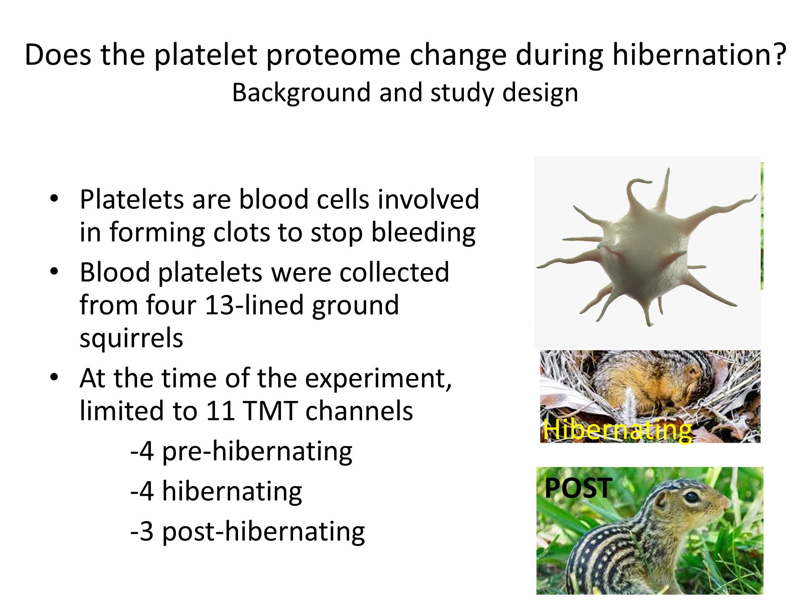
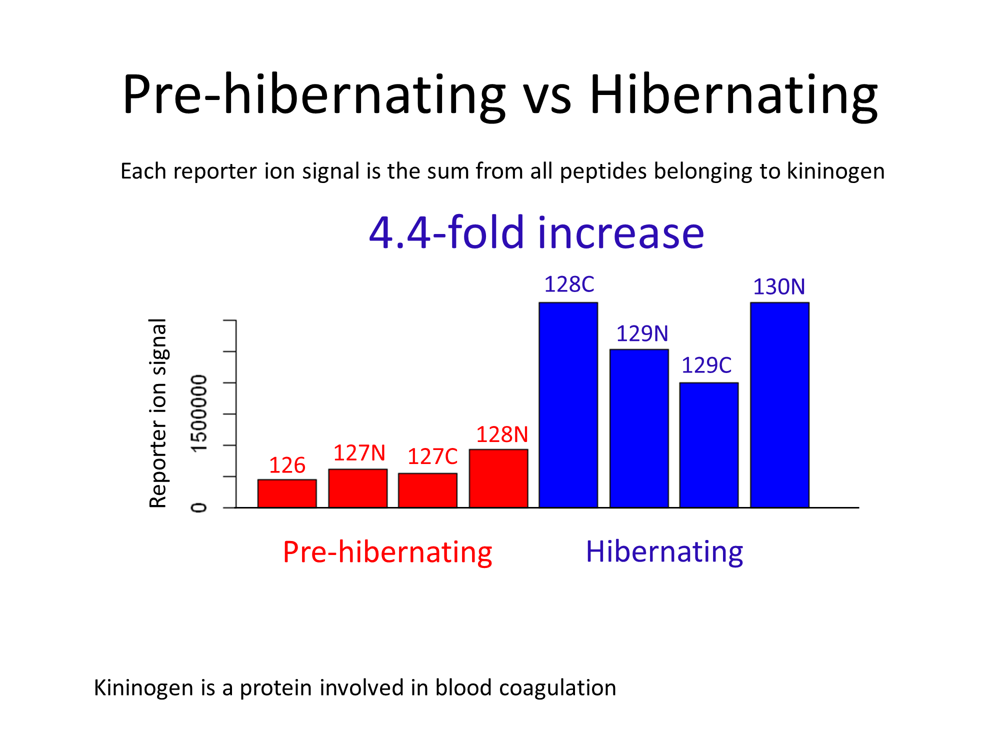
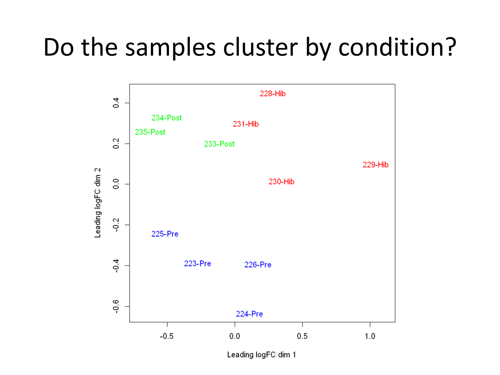
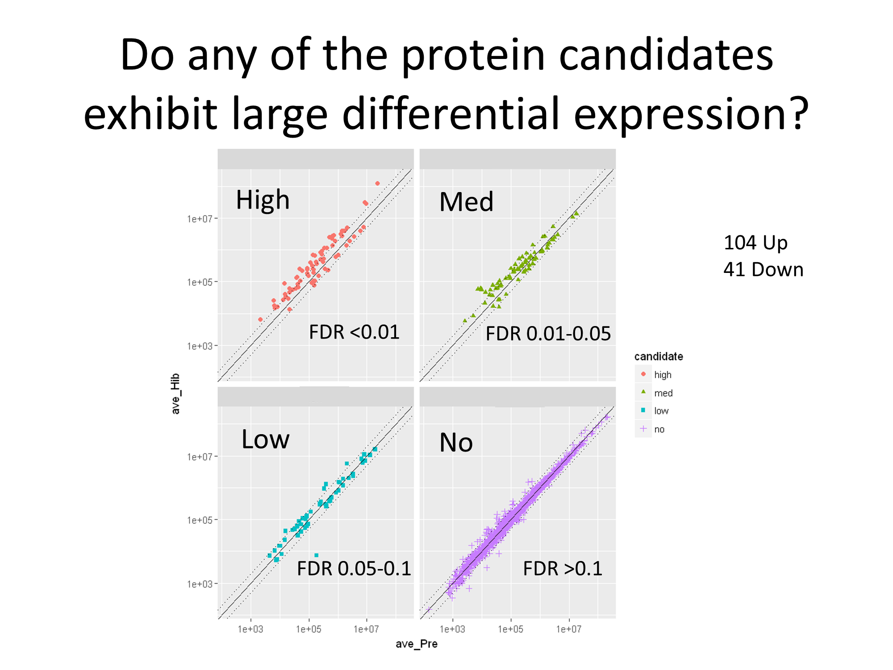
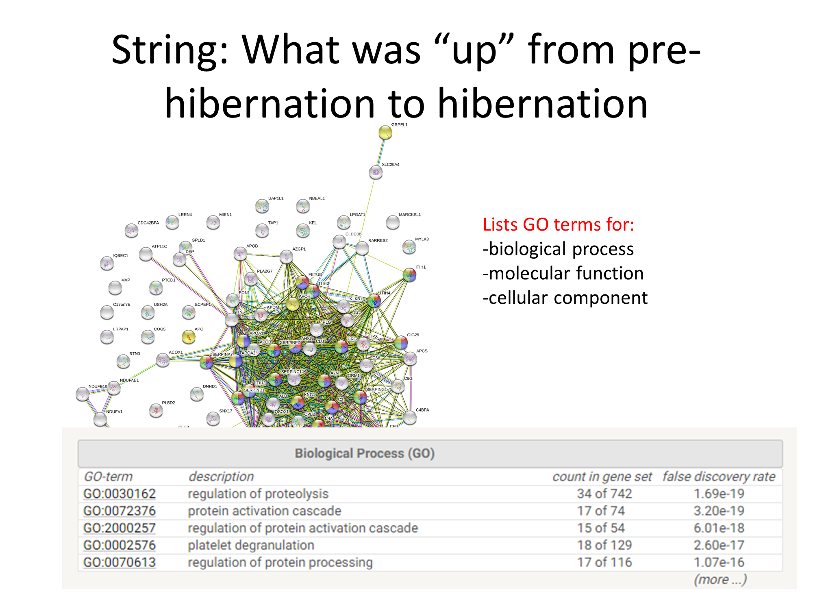
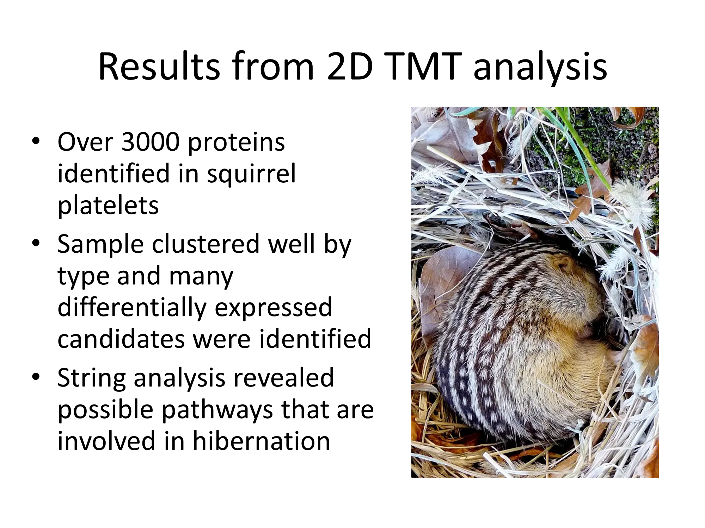

# squirrel_platelets_TMT_2020
Description of a TMT study of hibernating squirrel platelet samples performed at the OHSU PSR

---

# A Hibernating Squirrel Platelet Study with Tandem Mass Tags
## prepared by Jennifer Cunliffe
## Oregon Health & Science University Proteomcs Shared Resource
### (OHSU PSR)
### April 17, 2020

***

This was a collaboration with Dr. Scott Cooper at the University of Wisconsin - La Crosse. It also involved Dr. Joe Aslan at OHSU, our resident platelet expert. Blood platelets were collected from [13-lined ground squirrels](https://en.wikipedia.org/wiki/Thirteen-lined_ground_squirrel) before, during, and after winter hibernation.

***

There are many physiological changes that must occur during hibernation. Little may be known about most of them. A main function of platelets is to clot blood and hibernating animal blood does not clot. Are there any protein expression changes in the platelet proteome during hibernation? We can use isobaric labeling (also known as tandem mass tagging or TMT) and mass spectrometry to perform large-scale protein expression profiling.

***

TMT involves chemical reaction of peptides (not proteins) with special reagents. We first have to digest the proteins with trypsin and remove any buffer chemicals, like SDS and salts, that might interfere with the mass spectrometer. We have to reduce disulfide bonds (and block the cysteines) and denature the protein to digest with trypsin. Once we have peptides, we can label them with TMT reagents. We use liquid chromatography to spread out the complex peptide mixture and give the instrument time the measure the peptides.

***

We had 11 TMT reagents available (11-plex) when the experiment was done. There are now 16-plex reagents and we have methods to use more than one plex in a study. Each reagent that labels a particular biological sample has a unique low mass reporter ion that get liberated during the mass spectrometry. Here we see the reporter ions for one protein’s peptides for the pre-hibernation (in red) and hibernation samples (in blue). This protein has increased expression during hibernation.

***

Clustering views are a way to see if the experiment worked like we imagined. We might expect that the biological replicates within each condition would be similar to each other. If we have protein expression differences between groups, then we expect the clusters for each condition to be separated from each other. We can see that the blue cluster, the red cluster, and the green cluster are distinct.

***

We use statistical modeling to test the expression levels of each protein to see if they are the same between conditions or different. Here we have an MA plot where the x-axis is a measure of the protein abundance and the y-axis is the expression fold-change (log2 scale). The black horizontal band are the proteins whose expression was unchanged. The red proteins were over-expressed in hibernating squirrel platelets. The blue proteins were down regulated.

***

There are many different ways to visualize results. Here we have protein intensity scatter plots. The statistical test p-values are converted to false differential expression rates with the Benajimini-Hochberg multiple testing correction. We have used some FDR significance cutoffs to rank proteins into three DE candidate categories and the non-DE category. We have many high and medium DE candidates with more than 2-fold changes. Most of the non-DE proteins (lower right in purple) have less than 2-fold changes.

***

We can take the differentially expressed proteins and see what known functions they have and what pathways they are involved in. Not much is known about squirrel proteins, but a lot is known about human proteins. We can compare the squirrel protein sequences to human sequences using BLAST to find ortholog relationships. We can then do functional and pathway analysis using the information from the human orthologs.

***

We see a richer, more complicated network for up-regulated proteins compared to down-regulated proteins.

***

We were able to identify and quantify over 3000 squirrel platelet proteins. We had different expression patterns in each of the 3 conditions that were apparent from the cluster plot. We could test the proteins for differential expression and identify the proteins that were differentially expressed. We could use ortholog mapping and leverage human protein annotations to understand the functional and biological process changes associated with the hibernating ground squirrel platelet proteome.

***

Thank you!
